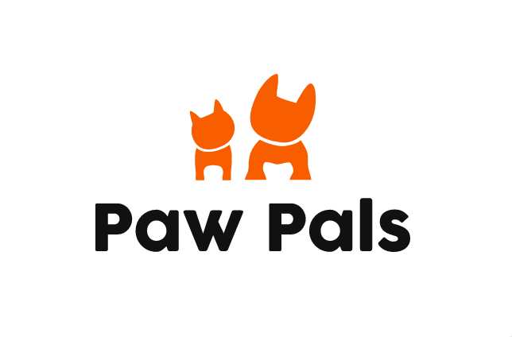

# paw-pals 🐶

Web app that allows dog owners to set up playdates for their dogs
<br>


<br>

**_Current status: improving design_**

# Table of Contents

- [paw-pals 🐶](#paw-pals-)
- [Table of Contents](#table-of-contents)
  - [Background](#background)
  - [Getting Started](#getting-started)
  - [Technology Used](#technology-used)
  - [Tech Implementation Details](#tech-implementation-details)
    - [Views](#views)
    - [Backend](#backend)
  - [File Descriptions](#file-descriptions)
  - [Learnings](#learnings)
  - [Credits](#credits)

## Background

Paw Pals exists to ensure that your dog is safe and always has other dogs to be best friends with and not interact with dogs that may be aggressive and cause trauma to your dog.

Our platform is a digital space that allows dog owners to create profiles for their dogs, detailing their characteristics, tendencies, and personalities. It facilitates communication with other profiles that are matched based on location and preferences, allowing them to set up playdates!

## Getting Started

1. Clone this repo (or fork if you'd like to contribute)
2. Run `npm install` from the command line to install dependencies for the root directory, then run `npm run install-all` to install dependencies for both frontend and backend directories
3. The backend communicates with a MySQL database and uses JSON web tokens for authorization of API endpoints. So you need to create a `.env` file in the `backend/` folder. Specify 5 variables:

   1. MYSQL_HOST
   2. MYSQL_USER
   3. MYSQL_PASS
   4. MYSQL_DB

      - These 4 variables come from and correspond to your MySQL instance. I recommend installing **MySQL Workbench** for working with MySQL. It has a great GUI. For the server, install **MySQL Community Server** for the database server.

   5. ACCESS_TOKEN_SECRET
      - You can generate a key from an online generator. The stronger the hashing the better.

   - For example:
     `MYSQL_HOST=localhost`

4. Run `npm start` from the command line to start the web server and react app 5. Navigate to localhost:3000 in your browser to access web app

This app is not deployed on a cloud server, so you can only access the app locally

## Technology Used

- Frontend: **React**
  <!-- - **Socket.io-client** for chat
  - **React-router** for routes
  - **Material UI** Library -->
- Backend: **Node.js** / **Express**
  <!-- - **Socket<area>.io** for real-time chat
  - **Sequelize** ORM to interact with database from backend -->
- Database: **MySQL**

## Tech Implementation Details

### Views

[Design](https://miro.com/app/board/uXjVPqyAEn4=/)

- Navbars:
  - Navbar for landing, login, signup pages
  - Side navbar for app pages
- Landing Page/Sign In/Sign Up Page (only page visible for non signed in users)
- App pages:
  - Home Page
  - Chats Page
  - Favorites Page
  - Profile Page

### Backend

Routes:

- Login (authentication w/ db)
- Signup (save user account data to db)
- Create user profile (attach user profile data to user account in db)
- Get profiles (all/filtered profiles from db)
- Get profile (get your or other user's profile data)
- Edit profile data
- Chats

Database Schema:
**_update this, as it has changed_**

```json
User {
  id,
  email,
  password
  favorites: [
  id1,
  id2,
  id3,
  ...
],
  Profile {
      firstName,
      lastName,
      city,
      state,
      phoneNumber,
      profilePic,
      description
      name,
      age,
      gender,
      weight,
      vaccinated,
      profilePic,
      gallery,
      tags,
      description
  },

  chats: {
    chatID, (gives you all the chats from this user... not needed)
    chatChannels: [
      {
        id1,
        messages: []
      },
      {
        id2,
        messages: []
      },
      {
        id8,
        messages: []
      },
      ...
    ]
  }
}
```

## File Descriptions

| Name                                 | Description                                               |
| ------------------------------------ | --------------------------------------------------------- |
| backend/index.js                     | Web server, app logic, and main point of entry for app    |
| backend/.env                         | Environment variables for database and JWT verification   |
| backend/routes/\*.js                 | Defines endpoints imported and used by the server         |
| backend/controllers/\*.js            | Defines the functions used by the route endpoints         |
| backend/utils/index.js               | Utility functions to authenticate requests                |
| backend/config/database.js           | Setup code to map sequelize ORM to database               |
| backend/models/\*.js                 | Defines database models and the associations between them |
| frontend/src/App.js                  | Main component for React app                              |
| frontend/src/components/\*           | Components used by App.js                                 |
| frontend/src/components/Landing/\*   | Components used for the Landing page                      |
| frontend/src/components/Navbar/\*    | Components used for the Navbar                            |
| frontend/src/components/Signup/\*    | Components used for the Signup page                       |
| frontend/src/components/Home/\*      | Components used for the user's Home page                  |
| frontend/src/components/Profile/\*   | Components used for the user's Profile page               |
| frontend/src/components/Favorites/\* | Components used for the user's Favorites page             |
| frontend/src/components/Chats/\*     | Components used for the user's Chats page                 |

## Learnings

Some things about making an app

Some things about storing things in databases

Some things about designing and engineering

## Credits

Sara, Stephen, Ian, Brent
